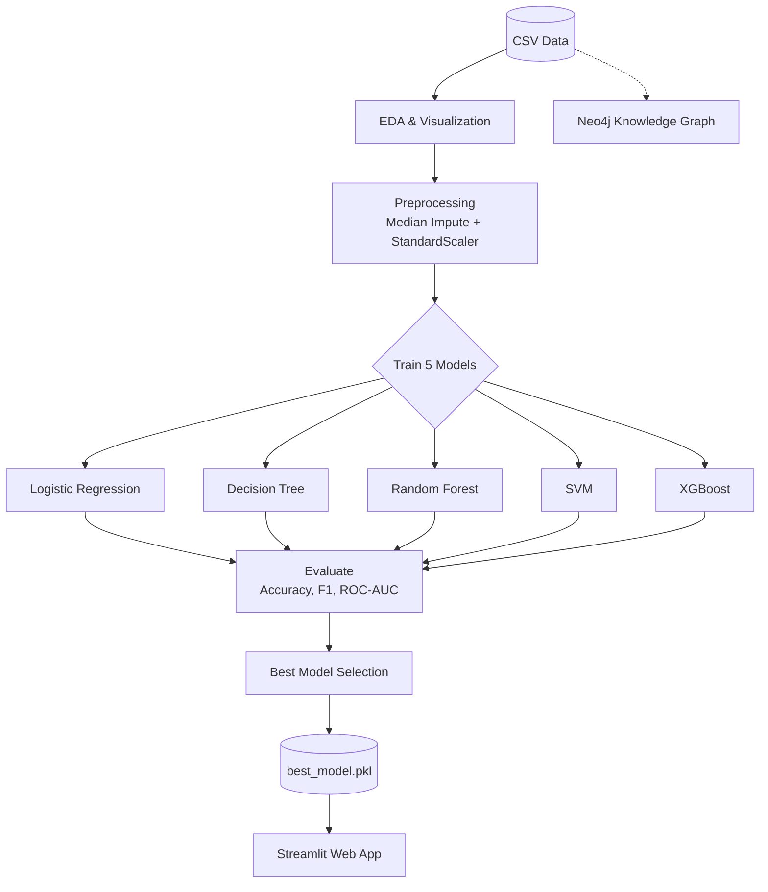

# 🩺 Hệ Thống Thông Minh Chẩn Đoán Nguy Cơ Đái Tháo Đường


## 1. Tổng Quan Dự Án
Đây là dự án Assignment 01 thuộc học phần Phát triển Hệ thống Thông minh (PTIT). Mục tiêu của dự án là xây dựng một mô hình phân lớp nhị phân có giám sát (supervised binary classification) để dự đoán nguy cơ mắc bệnh đái tháo đường dựa trên bộ dữ liệu Pima Indians Diabetes (768 mẫu × 9 đặc trưng). Dự án triển khai, đánh giá và so sánh 5 thuật toán Machine Learning khác nhau để chọn ra mô hình tối ưu nhất.

## 2. Kiến Trúc Hệ Thống



## 3. Cấu Trúc Thư Mục
```
diabetes/
├── data/
│   └── diabetes.csv
├── notebooks/
│   └── diabetes_prediction.ipynb
├── app/
│   ├── diabetes_app.py
│   └── models/
│       └── best_model.pkl
├── knowledge_graph/
│   ├── diabetes_ontology.cypher
│   ├── build_graph.py
│   └── query_examples.py
├── requirements.txt
└── README.md
```

## 4. Dataset
Sử dụng bộ dữ liệu Pima Indians Diabetes (từ Kaggle/UCI Machine Learning Repository).
- Số lượng bản ghi: 768
- Đặc trưng: 8 biến độc lập (features) + 1 biến phụ thuộc (target).

| Feature Name | Type | Description |
|---|---|---|
| Pregnancies | Numeric | Số lần mang thai |
| Glucose | Numeric | Nồng độ glucose huyết tương (mg/dL) |
| BloodPressure | Numeric | Huyết áp tâm trương (mm Hg) |
| SkinThickness | Numeric | Độ dày nếp gấp da cơ tam đầu (mm) |
| Insulin | Numeric | Lượng insulin trong huyết thanh 2 giờ (mu U/ml) |
| BMI | Numeric | Chỉ số khối cơ thể (kg/m²) |
| DiabetesPedigreeFunction | Numeric | Chỉ số di truyền đái tháo đường |
| Age | Numeric | Tuổi (năm) |
| Outcome | Categorical | Biến mục tiêu (0: Không bị, 1: Bị đái tháo đường) |

## 5. Cài Đặt & Thiết Lập Môi Trường
Yêu cầu Python 3.10 trở lên.

Cài đặt các thư viện cần thiết:
```bash
pip install pandas numpy scikit-learn matplotlib seaborn streamlit
```

Cài đặt các thành phần tùy chọn:
- Để sử dụng mô hình XGBoost: `pip install xgboost`
- Cài đặt Neo4j Desktop 5.x để chạy và truy vấn Knowledge Graph.

## 6. Hướng Dẫn Chạy Jupyter Notebook
1. Mở Jupyter Notebook / JupyterLab trong thư mục dự án.
2. Mở file `notebooks/diabetes_prediction.ipynb`.
3. Chạy toàn bộ các cells (Run All).
4. Notebook sẽ tự động thực hiện EDA, huấn luyện các mô hình, so sánh kết quả và lưu lại mô hình tốt nhất vào `app/models/best_model.pkl`.

## 7. Hướng Dẫn Khởi Động Ứng Dụng Streamlit
1. Mở terminal và di chuyển vào thư mục `app/`:
```bash
cd app
streamlit run diabetes_app.py
```
2. Mở trình duyệt và truy cập: `http://localhost:8501`
3. Nhập 8 chỉ số y tế vào biểu mẫu. Hệ thống sẽ trả về chẩn đoán và xác suất mắc bệnh.

*Luồng giao diện:* Người dùng nhập liệu bên trái/giữa màn hình -> Nhấn "Chẩn đoán" -> Kết quả hiển thị tức thì với màu sắc cảnh báo (Xanh: An toàn, Đỏ: Nguy cơ).

## 8. Hướng Dẫn Nạp Knowledge Graph Neo4j
1. Cài đặt và chạy ứng dụng Neo4j Desktop, tạo một database mới và khởi động.
2. **Cách 1:** Mở Neo4j Browser, copy nội dung file `knowledge_graph/diabetes_ontology.cypher` và chạy để tạo đồ thị.
3. **Cách 2:** Chạy script Python (đảm bảo đã cài `pip install neo4j`):
```bash
python knowledge_graph/build_graph.py --uri bolt://localhost:7687 --user neo4j --password <your_password>
```
4. Kiểm tra dữ liệu trong Neo4j Browser:
```cypher
MATCH (n) RETURN labels(n), count(n)
```
5. Tham khảo và chạy các truy vấn mẫu trong `knowledge_graph/query_examples.py`.

## 9. Kết Quả Thực Nghiệm

| Tên mô hình | Độ chính xác (Accuracy) | F1-Score | ROC-AUC |
|---|---|---|---|
| Logistic Regression | ~77% | ~0.65 | ~0.83 |
| Decision Tree | ~71% | ~0.58 | ~0.68 |
| Random Forest | ~78% | ~0.66 | ~0.84 |
| SVM | ~76% | ~0.63 | ~0.82 |
| XGBoost | ~76% | ~0.64 | ~0.82 |

*(Lưu ý: Kết quả có thể thay đổi nhẹ tùy theo random_state và cách chia train/test)*

## 10. Công Nghệ Sử Dụng
- **Ngôn ngữ:** Python
- **Xử lý & Phân tích dữ liệu:** pandas, numpy
- **Machine Learning:** scikit-learn, xgboost
- **Trực quan hóa:** matplotlib, seaborn
- **Giao diện người dùng:** Streamlit
- **Cơ sở tri thức (Knowledge Graph):** Neo4j

## 11. Tác Giả & Giấy Phép
- **Sinh viên thực hiện:** Học viên PTIT
- **Dự án:** Assignment 01 - Phát triển Hệ thống Thông minh
- **Giảng viên hướng dẫn:** PGS.TS. Đinh Quê Trần
