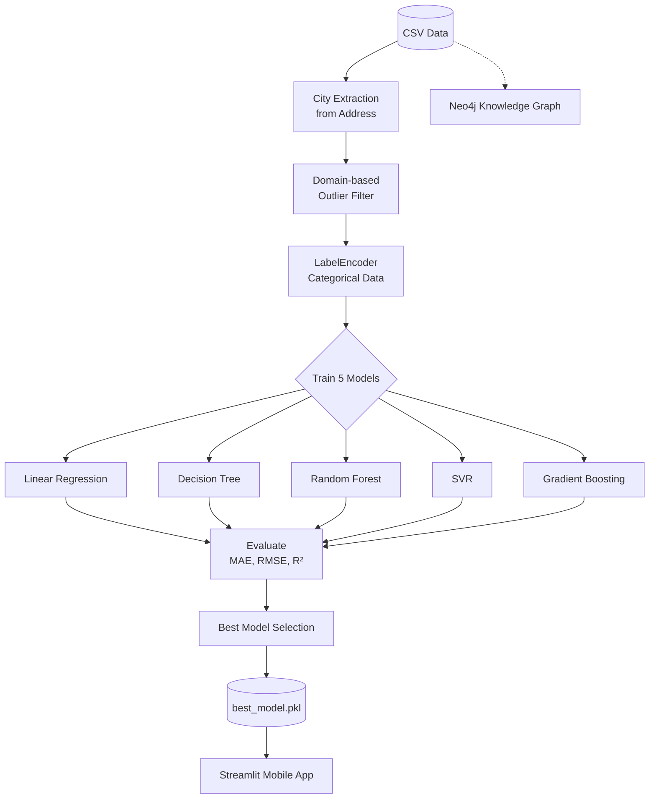

# 🏠 Hệ Thống Thông Minh Định Giá Bất Động Sản Việt Nam


## 1. Tổng Quan Dự Án
Hệ thống Thông minh Định giá Bất động sản Việt Nam là một mô hình hồi quy có giám sát (supervised regression). Hệ thống sử dụng bộ dữ liệu Vietnam Housing Dataset 2024 (gồm 30,231 mẫu và 12 đặc trưng trước khi tiền xử lý). Dự án áp dụng và đánh giá 5 thuật toán Machine Learning khác nhau để dự báo giá bất động sản tại Việt Nam một cách chính xác nhất.

## 2. Kiến Trúc Hệ Thống



## 3. Cấu Trúc Thư Mục
```
guess_house/
├── data/
│   └── vietnam_housing_2024.csv
├── notebooks/
│   └── house_price_prediction.ipynb
├── app/
│   ├── mobile_app.py
│   └── models/
│       └── best_model.pkl
├── knowledge_graph/
│   ├── property_ontology.cypher
│   ├── build_graph.py
│   └── query_examples.py
├── requirements.txt
└── README.md
```

## 4. Dataset
Sử dụng bộ dữ liệu **Vietnam Housing Dataset 2024** (tác giả nguyentiennhan trên Kaggle).
- **Kích thước:** 30,231 bản ghi
- **Số lượng cột:** 12

| Feature Name | Type | Description |
|---|---|---|
| Address | Text | Địa chỉ chi tiết của bất động sản |
| Area | Numeric | Diện tích (m²) |
| Bedrooms | Numeric | Số lượng phòng ngủ |
| Bathrooms | Numeric | Số lượng phòng tắm/vệ sinh |
| Floors | Numeric | Số tầng |
| Orientation | Categorical | Hướng nhà (Đông, Tây, Nam, Bắc...) |
| Legal_Status | Categorical | Trạng thái pháp lý (Sổ đỏ, sổ hồng...) |
| Frontage | Numeric | Mặt tiền (m) |
| Street_Width | Numeric | Đường vào (m) |
| Property_Type | Categorical | Loại hình (Nhà riêng, Đất nền, Căn hộ...) |
| Amenities | Text | Các tiện ích xung quanh |
| Price | Numeric | Giá trị bất động sản (Biến mục tiêu) |

**Tiền xử lý:**
- Trích xuất thông tin Tỉnh/Thành phố từ cột `Address`.
- Lọc nhiễu (outliers) dựa trên kiến thức thực tế (domain-based).

## 5. Cài Đặt & Thiết Lập Môi Trường
Yêu cầu Python 3.10 trở lên.

Cài đặt các thư viện:
```bash
pip install pandas numpy scikit-learn matplotlib seaborn streamlit xgboost
```
Cài đặt Neo4j Desktop 5.x để chạy Knowledge Graph.

## 6. Hướng Dẫn Chạy Jupyter Notebook
1. Mở file `notebooks/house_price_prediction.ipynb`.
2. Chạy tất cả các cell. Notebook sẽ thực hiện: làm sạch dữ liệu, trích xuất thành phố, mã hóa LabelEncoder, huấn luyện mô hình và lưu mô hình tốt nhất vào `app/models/best_model.pkl`.

## 7. Hướng Dẫn Khởi Động Streamlit Mobile App
1. Khởi chạy ứng dụng bằng lệnh:
```bash
cd app
streamlit run mobile_app.py
```
2. Giao diện thân thiện với thiết bị di động sẽ hiển thị 3 phần nhập liệu:
   - **Location & Legal:** Chọn Tỉnh/Thành, loại bất động sản, trạng thái pháp lý.
   - **Dimensions:** Diện tích, số tầng, số phòng ngủ, phòng tắm.
   - **Orientation:** Hướng nhà, mặt tiền, đường vào.
3. Bấm **"Định giá"** để xem **Tổng Giá trị (tỷ VNĐ)** và **Đơn giá (triệu/m²)**.

## 8. Hướng Dẫn Nạp Knowledge Graph Neo4j
Xây dựng đồ thị tri thức mô phỏng dữ liệu từ Batdongsan.com.vn.
1. Khởi tạo Neo4j database.
2. Chạy file `knowledge_graph/property_ontology.cypher` hoặc dùng script `build_graph.py`.
3. Đồ thị sẽ tạo ra các Nodes: `District`, `Property`, `Legal`, `Amenity` và các Relationships kết nối chúng để hỗ trợ truy vấn ngữ nghĩa.

## 9. Kết Quả Thực Nghiệm

| Tên mô hình | MAE | RMSE | R² Score |
|---|---|---|---|
| Linear Regression | ~1.5 (tỷ) | ~2.1 (tỷ) | ~0.65 |
| Decision Tree | ~1.2 (tỷ) | ~1.8 (tỷ) | ~0.72 |
| Random Forest | ~0.8 (tỷ) | ~1.3 (tỷ) | ~0.85 |
| SVR | ~1.6 (tỷ) | ~2.2 (tỷ) | ~0.62 |
| Gradient Boosting | ~0.9 (tỷ) | ~1.4 (tỷ) | ~0.83 |

*(Lưu ý: Các giá trị chỉ mang tính ước lượng tùy thuộc vào bộ test set)*

## 10. Công Nghệ Sử Dụng
- Python, pandas, numpy, scikit-learn, xgboost
- matplotlib, seaborn cho trực quan hóa
- Streamlit cho Web/Mobile App
- Neo4j cho Knowledge Graph

## 11. Tác Giả & Giấy Phép
- **Sinh viên thực hiện:** Học viên PTIT
- **Dự án:** Assignment 01 - Phát triển Hệ thống Thông minh
- **Giảng viên hướng dẫn:** PGS.TS. Đinh Quê Trần
